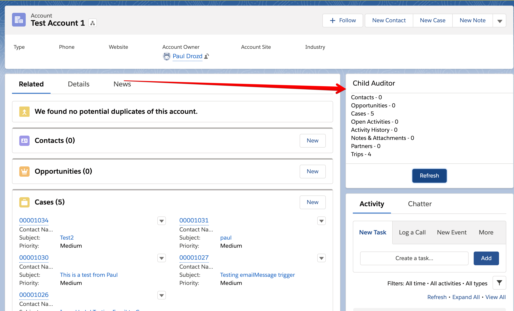
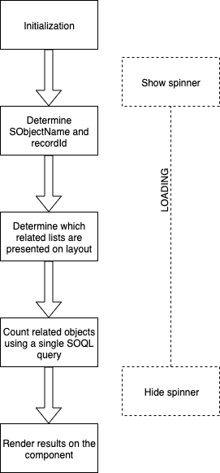
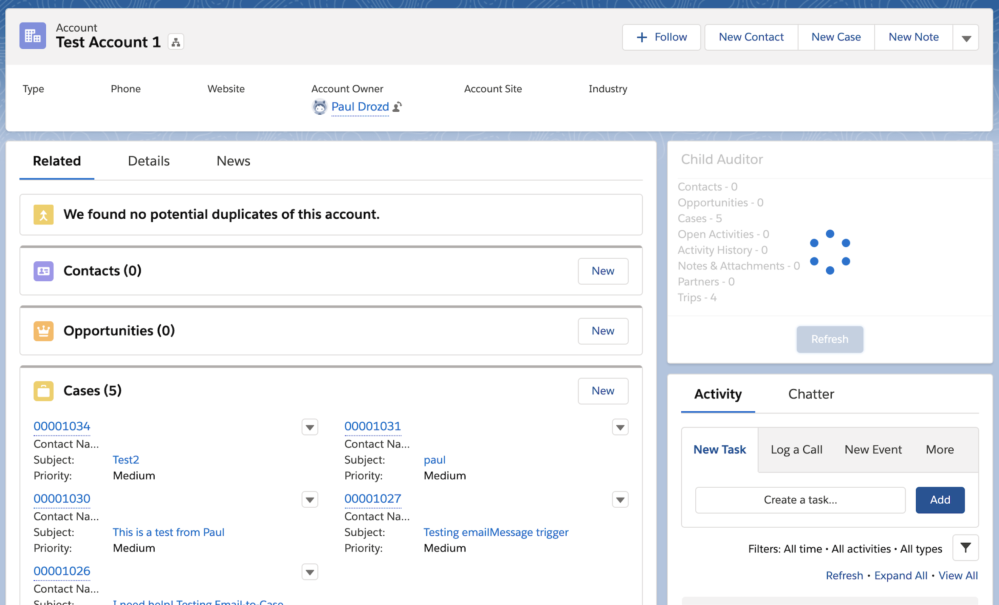
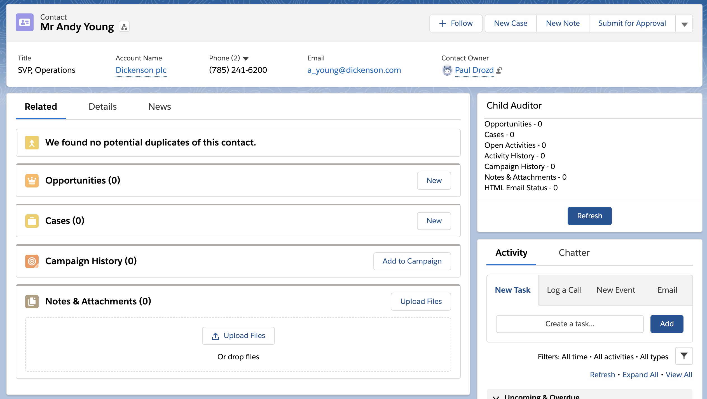
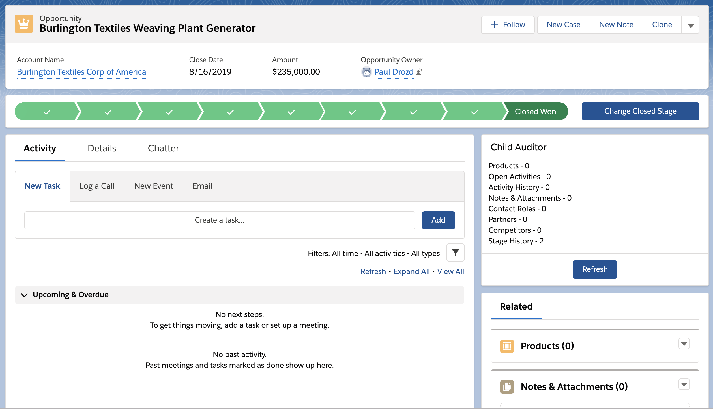
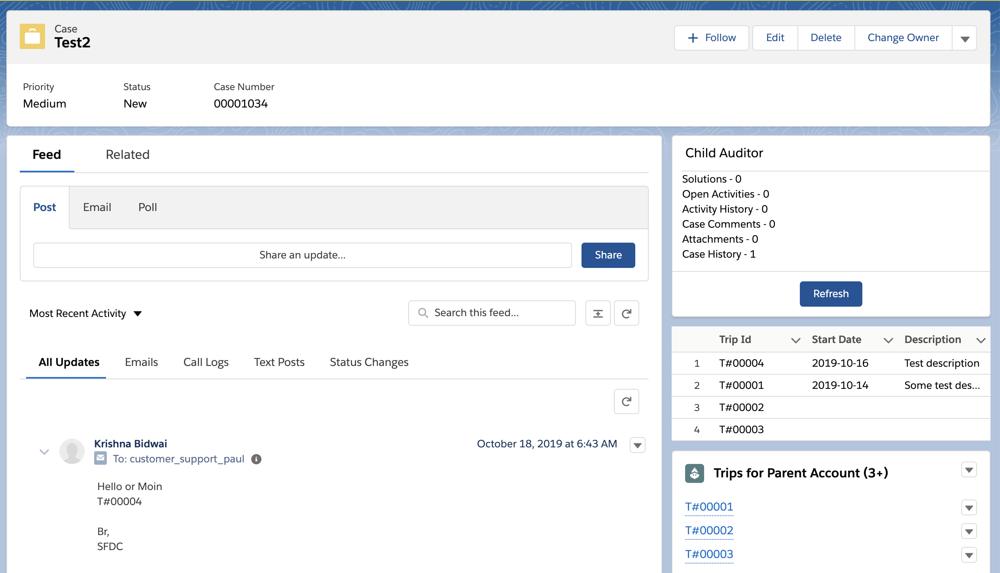

# Coral Team Child Auditor Test

> The component shows statistics about related objects (Account screen below)

**Solution**

- I've decided to show only business-valuable objects, because this component is needed by Salesforce users, not by analytics
- This component DOESN'T display system or setup Objects like AccountContentHistory, etc.
- It improves performance - the component renders very quickly 
- The component shows child objects which are presented on SObject's layouts and accessible by Salesforce users
- Child objects are determined dynamically using Metadata API
- The component uses single SOQL to fetch related objects and count them
- Spinner support is added
- The component is generic and can be added to any SObject detail screen

**Pros of the solution**
- Good performance
- Low usage of limits (single SOQL query and 1 Metadata API request)
- The solution is generic (any SObject)
- Simplicity
- All business-valuable objects are visible on the component, so it can be used by Sales/Service/Opps teams
- The solution is extendable and can be imrpoved (caching metadata, etc.)

**Cons of the solution**
- Metadata API must be accessed to fetch accessible related lists
- This solution works only for "domain" business objects, not with SF-internal support objects. So this is not a solution for Salesforce database analysis

**Flow"**

**Spinner**

**Contact screen**

**Opportunity screen**

**Case screen**

